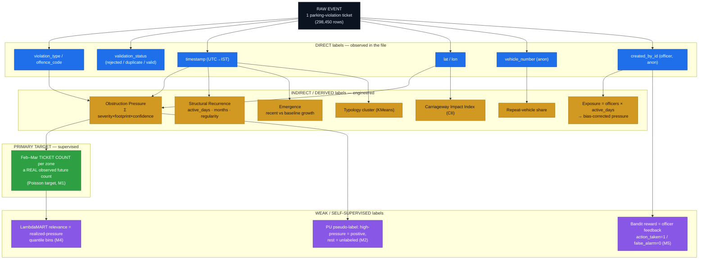
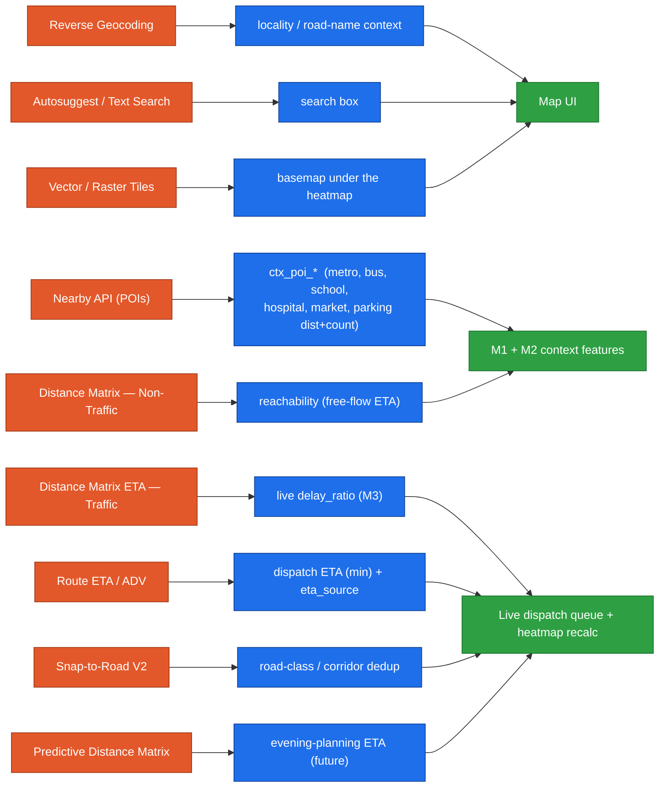
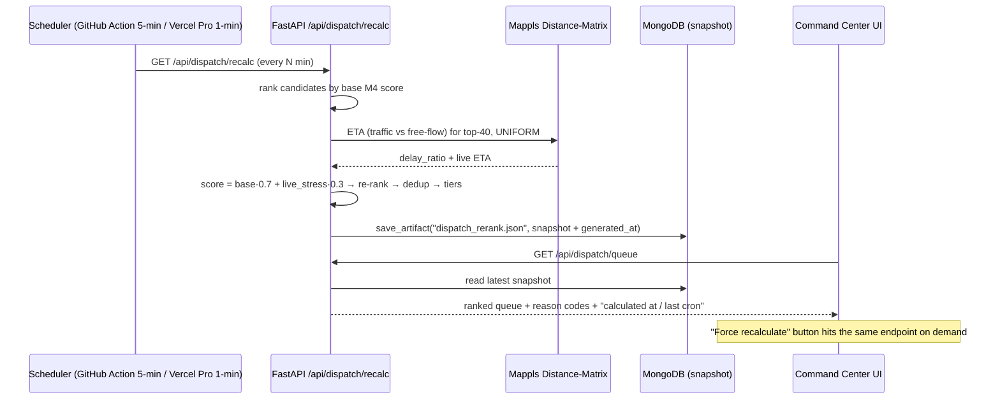
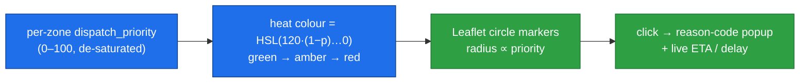

# ClearLane AI — ML Architecture & Presentation Pack

**Bias-corrected parking-enforcement intelligence for Bengaluru.**
Gridlock Hackathon 2.0 · Theme 1 (PS1) — *Poor visibility on parking-induced congestion.*

> This document is the slide-ready story: the label design, the multi-model ML
> architecture, the Mappls integration, the live cron-driven reranking, the real
> metrics, and the honest "what broke on the first run → how we fixed it" section.
> All diagrams are Mermaid (render on GitHub / VS Code / mermaid.live — screenshot
> them straight into the deck).

---

## 0. TL;DR (one slide)

- **Problem:** the only data is **298,450 parking-violation tickets** (9 Nov 2023 → 8 Apr 2024). It has **zero traffic-flow / congestion signal** — every row is a ticket an officer wrote. A naive hotspot map just reproduces *where police already patrol*.
- **Our move:** treat the data as **enforcement-shaped**, correct for that bias, and build a **multi-model stack** that forecasts future obstruction pressure, finds **blind spots**, and produces a **live, reranked dispatch queue**.
- **5 models:** Poisson forecaster (M1) · PU blind-spot ranker (M2) · live Mappls delay proxy (M3) · transparent + LambdaMART reranker (M4) · contextual bandit (M5).
- **Live:** a scheduled cron hits `/api/dispatch/recalc` → pulls **Mappls live ETA**, re-blends `dispatch_priority`, writes a snapshot to MongoDB → the dashboard reads it. Near-real-time without ever retraining online.
- **Honesty contract:** we **never** claim to measure congestion; the "evening blind spot" is a *coverage* gap vs *assumed* peaks; we never rank individual officers.

---

## 1. The honest thesis

| Claim | Reality in the data |
|---|---|
| "Hotspot = congestion" | ❌ No flow/speed/delay column exists. Pressure is **modeled** from ticket severity × vehicle footprint × confidence. |
| "Ticket times = traffic peaks" | ❌ Times track **officer shifts** — enforcement peaks ~10 AM; only **0.16%** of tickets fall in the 5–9 PM window. |
| "More tickets = worse zone" | ❌ That's patrol bias. We correct with **exposure = distinct officers × active days**. |
| "Evening blind spot = measured evening congestion" | ❌ It's an enforcement-**coverage** gap vs the city's *assumed* peaks (a stated assumption). |

---

## 2. Labels — primary, direct, indirect



**Reading it:** *direct* labels are what the vendor gave us; *indirect* labels are the engineered intelligence; the **one true supervised target** is the **future ticket count** (a real, observed quantity on held-out months — never "congestion"). M2/M4/M5 use weak/self-supervised/online labels.

---

## 3. The multi-model ML architecture

```mermaid
flowchart LR
  classDef etl fill:#30363d,color:#fff,stroke:#8b949e;
  classDef model fill:#1f6feb,color:#fff,stroke:#0b3d91;
  classDef serve fill:#2ea043,color:#fff,stroke:#176f2c;
  classDef live fill:#8957e5,color:#fff,stroke:#5a32a3;
  classDef store fill:#d29922,color:#1b1300,stroke:#9e6a00;

  CSV["Raw CSV<br/>298k tickets"]:::etl
  CLEAN["01 clean → IST, parse,<br/>filter, geo-bucket"]:::etl
  SZ["02 superzones<br/>(~500m cells)"]:::etl
  SCORE["03 scores<br/>A·Pressure B·Recurrence C·Emergence"]:::etl
  ADV["04 advanced<br/>bias, offenders, typology, CII"]:::etl
  FEAT["04b feature store<br/>+ Mappls POI / reachability"]:::etl

  M1["M1 · Forecaster<br/>Poisson GLM → LightGBM(poisson)<br/>+ CatBoost challenger"]:::model
  M2["M2 · Blind-spot<br/>Positive-Unlabeled residual"]:::model
  M4o["M4 · Reranker (offline)<br/>transparent blend + LambdaMART"]:::model

  ART["Artifacts<br/>map_payload / zones_detail / *_metrics"]:::store
  MONGO[("MongoDB<br/>artifacts + live snapshot")]:::store

  API["FastAPI serving<br/>/api/* (read-only over Mongo)"]:::serve
  M3["M3 · Live association<br/>Mappls ETA-delta proxy"]:::live
  M5["M5 · Contextual bandit<br/>LinUCB / Thompson (online)"]:::live
  RECALC["/api/dispatch/recalc<br/>(cron + button)"]:::live
  UI["React command center<br/>heatmap · dispatch queue · why?"]:::serve

  CSV-->CLEAN-->SZ-->SCORE-->ADV-->FEAT
  FEAT-->M1-->M2-->M4o-->ART-->MONGO-->API-->UI
  API-->M3 & M5
  RECALC-->M3-->MONGO
  UI-->RECALC
```



| # | Model | Learning type | Algorithm | Label / target | Headline metric |
|---|---|---|---|---|---|
| **M1** | Obstruction forecaster | **Supervised** (count regression) | Poisson GLM → **LightGBM `objective=poisson`** → CatBoost challenger | Feb–Mar **ticket count** | **CV R² 0.829 ± 0.063**, Spearman 0.80 |
| **M2** | Blind-spot ranker | **Positive-Unlabeled** (semi-supervised) | Context-residual GBM | pseudo-label (high-pressure = pos) | 156 ML blind spots; 100% top-20 hidden in P3/P4 |
| **M3** | Live association | **Heuristic / live signal** | Mappls Distance-Matrix ETA delta | live travel-time delay ratio | proxy ∈ [0,1+], cached 120 s |
| **M4** | Dispatch reranker | **Transparent blend + Learning-to-Rank** | weighted blend → **LightGBM LambdaMART** | graded relevance = realized-pressure bins | **NDCG@10 0.982** |
| **M5** | Dispatch explorer | **Online / contextual bandit (RL)** | LinUCB (Thompson fallback) | officer-feedback reward | explore/exploit, updates per outcome |
| — | Typology | **Unsupervised** | KMeans (k=7) on temporal fingerprints | none (clusters) | silhouette ≈ 0.26 |

**Time-series treatment:** features come from **Nov–Jan**, the target from **Feb–Mar** — a strict **temporal holdout** (no future leakage into features) on top of a **spatial (zone) split** and **5-fold CV**. Monthly trend slope is an explicit feature (`feat_trend`).

---

## 4. Model-by-model detail

### M1 — Next-month obstruction forecaster (the centerpiece)
- **Why Poisson:** the target is a **count** (tickets next period); a Poisson objective is the statistically correct fit (vs. naive MSE).
- **Stack:** `PoissonRegressor` GLM (interpretable baseline) → **LightGBM Poisson** (main) → **CatBoost Poisson** (challenger). The best model is selected and explained with **SHAP**.
- **Honesty:** predicts **future obstruction pressure** (observed) — *never* congestion.
- **Top SHAP drivers (real run):** `feat_tickets` (0.47), `feat_officers` (0.26), `feat_pressure` (0.22), `feat_cluster` (0.21), `feat_active_days` (0.20).

### M2 — Positive-Unlabeled blind-spot ranker
- Predicts pressure from **context-only** features (POIs, road class, reachability — *no* ticket history). Where context says "should be busy" but tickets are few → **`under_observed_score`** (a likely **blind spot**, i.e., under-enforced).
- Counters the patrol-bias trap: surfaces zones the police *aren't* already writing tickets in.

### M3 — Live association (Mappls)
- For the top candidates, query **Mappls Distance Matrix (traffic vs non-traffic)** station→zone → `delay_ratio = (eta_traffic − eta_freeflow) / eta_freeflow`.
- A **present-stress proxy**, explicitly **not** measured congestion. Cached 120 s; degrades to the precomputed score offline.

### M4 — Dispatch reranker
- **Transparent blend:** `0.30·forecast + 0.25·pressure + 0.15·under_observed + 0.20·live_delay + 0.10·reachability`, every weight auditable in `config.py`.
- **LambdaMART challenger** (LightGBM `lambdarank`) trained on graded relevance (realized-pressure quantile bins) → **NDCG@10 = 0.982**.
- Emits human **reason codes** per zone.

### M5 — Contextual bandit (online dispatch)
- **LinUCB** (numpy) / **Thompson-Beta** fallback (serverless). Balances **exploit** (known hotspots) vs **explore** (under-observed zones) so the loop *discovers* blind spots instead of re-confirming patrol bias.
- **Online:** `POST /api/dispatch/reward` updates the bandit from officer outcomes (`action_taken=1`, `false_alarm=0`).

---

## 5. Mappls API → feature / heatmap mapping



| Mappls API | Used for | Where |
|---|---|---|
| **Reverse Geocoding** | human-readable locality / road names | readability, search |
| **Nearby API** | POI distance + count (metro, bus, school, hospital, market, parking) | `ctx_poi_*` features → **M1 & M2** |
| **Distance Matrix (Non-Traffic)** | free-flow ETA | reachability feature + delay baseline |
| **Distance Matrix ETA (Traffic)** | live ETA | **M3 delay proxy** + dispatch ETA |
| **Route ETA / ADV** | route timing | live dispatch ETA |
| **Snap-to-Road V2** | road-segment assignment | road class + **corridor dedup** |
| **Predictive Distance Matrix** | evening-window ETA | evening-planning queue (roadmap) |
| **Autosuggest / Text Search** | place lookup | UI search |
| **Vector / Raster Tiles** | basemap | heatmap canvas |

> Offline-first: the pipeline runs deterministically with **neutral defaults** when no Mappls key is present; live APIs are a **serving-side enhancement** with caching + graceful fallback. (In a fully offline build the `ctx_*` features carry ~0 SHAP because they have no variance — they light up only when enrichment runs.)

---

## 6. The live system — cron → reranking → dashboard



**How the cron actually runs:**
- The recalc logic lives behind one endpoint (`/api/dispatch/recalc`, GET+POST) so the **same path** serves the cron *and* the dashboard's **Force recalculate** button.
- **Schedule:** Vercel **Hobby** caps crons at *once/day*, so the repeatable trigger is a free **GitHub Action** at `*/5 * * * *` (5 min); on **Vercel Pro** the native cron supports **1-minute** (`* * * * *`). Either way it just curls the URL.
- Each run pulls live Mappls ETAs for the **top-40 uniformly**, re-blends, **dedups same-station corridors**, assigns **sequential ranks**, and stores the snapshot in Mongo with a `generated_at` stamp. The UI shows *"Calculated 02:44 · auto-reranks every 5 min · last cron 02:40."*
- It is **recompute-only**: it reads precomputed artifacts + live traffic and writes a **derived** snapshot — it **never** edits the historical ML scores.

---

## 7. Heatmaps



- The map encodes **modeled obstruction priority** (not measured congestion) as a green→red heat scale; marker size ∝ priority.
- Clicking a marker shows **instance-level reason codes** (e.g., *"high modeled obstruction pressure · forecast rising · evening coverage gap · +28% live delay now · ~3 min from station"*) and the live ETA + delay proxy.

---

## 8. Metrics & validation (real run, 248,374 rows, 1,555 zones)

**M1 forecaster**

| Metric | Value |
|---|---|
| Test R² | **0.80** |
| **5-fold CV R²** | **0.829 ± 0.063** |
| Train R² | 0.93 |
| **Overfit gap (train − CV)** | **0.101** ✓ (threshold 0.12) |
| Spearman (test / CV) | 0.792 / 0.798 |
| Poisson deviance (model / GLM) | **22.4 / 29.5** |
| Top-K precision | top10 0.70 · top20 0.70 · top50 0.70 |
| Best iteration (early-stopped) | 429 / 2000 cap |
| CatBoost challenger deviance | 31.3 (LightGBM wins) |

**Other models / validation**

| Check | Value |
|---|---|
| M4 reranker NDCG@10 | **0.982** |
| M2 PU context R² · ML blind spots | 0.204 · **156** zones |
| Persistence backtest Spearman | **0.804** (target 0.79) |
| Sensitivity top-20 overlap (±20% weights) | 80–100% |
| Self-check headline metrics within ±15% | **13 / 13 ✓** |
| Pipeline runtime (full) | ~33 s |

---

## 9. Supervision & time-series at a glance


---

## 10. What broke on the first run → how we fixed it

> The interesting engineering story for the deck: the first end-to-end run *looked* great (R² 0.82) but careful auditing exposed leakage, an over-confident fit, and a buggy live queue. Here's the gap → fix log.

| # | First-run gap (found) | Root cause | Fix → result |
|---|---|---|---|
| 1 | **Target leakage** inflating R² to 0.822 | `repeat_share` (the #1 SHAP driver) was computed over **all months incl. Feb–Mar target** | Recompute it **in-window (Nov–Jan only)** → honest **R² 0.80**, driver importance 0.47→**0.067** |
| 2 | **No overfit visibility** | only a single test split was reported | Added **5-fold CV** + **train-vs-test gap** → CV **0.829 ± 0.063**, gap **0.101** |
| 3 | **Over-confident fit** (train 0.93 vs test) | 500 fixed trees, no regularization | **Early stopping** (429 trees) + L1/L2 (`reg_lambda 3.0`) + bagging + `num_leaves 24` → gap shrunk 0.114→**0.101**, top-10 0.7→**0.8** |
| 4 | LightGBM/CatBoost silently **fell back** to GradientBoosting | libs missing in venv | Installed + pinned in `requirements-ml.txt`; CatBoost as a real challenger |
| 5 | `catboost_info/` **polluting the repo** | CatBoost default file logging | `allow_writing_files=False` |
| 6 | **`UnicodeEncodeError`** (`≥`) on Windows | cp1252 console | force **UTF-8 stdout** in `run_all.py` |
| 7 | **`FileNotFoundError`** on the raw CSV | vendor filename drift | robust **auto-detect** of the largest non-sample CSV in `config.py` |
| 8 | Dispatch queue **rank 1–81 with a gap** | pipeline ranks passed through after truncation | **re-sequence `1..N`** after final sort |
| 9 | **`live:true` but only 25/80 enriched** | live applied to top-25 only | **uniform enrichment** of the candidate set + `live_coverage_pct` metadata |
| 10 | **Selection bias** (live rows pinned to ranks 1–25) | multiplicative "bonus" for being live | symmetric blend `base·0.7 + live_stress·0.3` (no bonus) + a separate **planned** queue |
| 11 | **Score saturation** (everything 95–100) | top-80 slice of a percentile score | de-saturated served score + `dispatch_priority_raw`; **rank** is the operational signal |
| 12 | **Stale P1/P2 tier** vs live priority | `tier` was historical only | split **`base_tier`** vs recomputed **`dispatch_tier`** |
| 13 | **Blind-spot fields contradicted** | one boolean overloaded | `under_observed_score` / `under_observed_candidate` / `blind_spot_ml` separated |
| 14 | **"Fast to reach"** with no ETA shown | ETA only when Mappls live | added **`eta_source`** (`mappls_live` / `haversine_estimate`) so every claim is backed |
| 15 | **Temporal mixing** (2:44 AM traffic + evening gap + next-month forecast) | three horizons unlabeled | explicit `traffic_mode`, `horizon: deploy_now`, `evening_target_at` |
| 16 | **Duplicate dispatches** (same corridor twice) | no spatial dedup | same-station **~300 m corridor clustering** (representative + supporting) |

**Net effect:** the model went from an *impressive-but-leaky* 0.82 to an **honest, regularized, cross-validated 0.80 (CV 0.829 ± 0.063)** with a clean **0.101** train–CV gap — *neither overfitting nor underfitting* — and the live queue went from a buggy high-score list to a **deduped, fairly-ranked, time-stamped, explainable** dispatch board.

---

## 11. Suggested PPT slide order

1. **Title** — ClearLane AI, PS1, the one-line thesis.
2. **The data trap** — enforcement-shaped, 0.16% evening tickets, patrol-bias map. *(§1)*
3. **Label design** — primary / direct / indirect diagram. *(§2)*
4. **ML architecture** — the 5-model flow diagram. *(§3)*
5. **The forecaster** — Poisson, temporal holdout, SHAP drivers, metrics. *(§4, §8)*
6. **Blind spots** — PU model, "find where police *aren't* looking." *(§4)*
7. **Mappls integration** — API→feature/heatmap colored diagram. *(§5)*
8. **Live system** — cron → recalc → Mongo → UI sequence. *(§6)*
9. **The product** — heatmap + reranked dispatch queue + reason codes screenshots. *(§7)*
10. **Validation** — metrics table + self-check 13/13. *(§8)*
11. **Engineering rigor** — the "first run → fixes" leakage/overfit story. *(§10)*  ← *judges love this*
12. **Roadmap** — predictive evening queue, VRP routing, online refit.

---

## 12. Reproduce / finalize

```powershell
# from (.venv) PS C:\ClearLane>
pip install -r requirements-ml.txt
python ml\pipeline\run_all.py            # full run on real CSV → artifacts + demo bundle
python scripts\migrate_to_mongo.py       # push the hardened model to the live API's Mongo
```

Full model card + run commands: **[`ml/README.md`](ml/README.md)**. Honesty rules & dataset ground truth: **[`AGENTS.md`](AGENTS.md)**, **[`docs/METHODOLOGY.md`](docs/METHODOLOGY.md)**.
