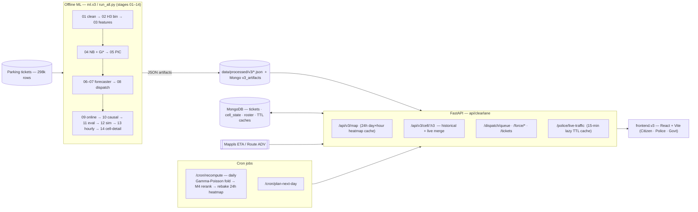
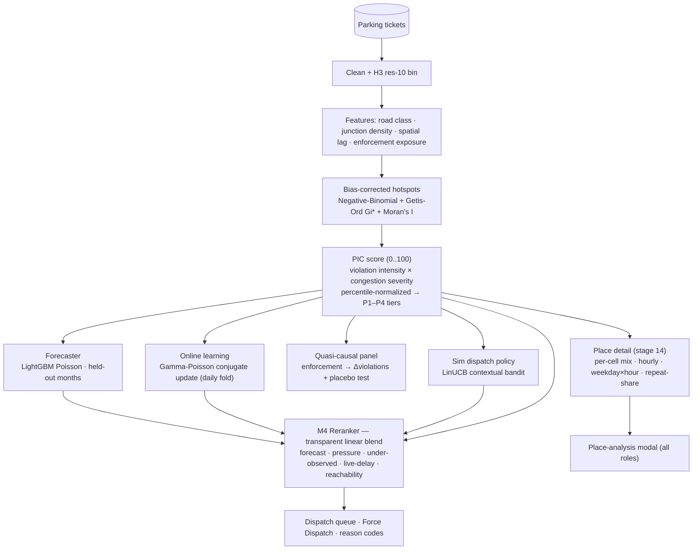

# TraFix — Pitch Deck

> **Traffic, Fixed.** Turning the data a city already has into the deployment plan it doesn't.
> *(Engine codename: ClearLane.)*

---

## 1 · The name & the product, born

Bengaluru loses hours every day to congestion — and the cheapest, most fixable cause is **illegal parking that blocks a lane**. Yet the city had **no congestion sensors** for it. What it *did* have: **5 months of parking-violation tickets** (298k rows, Nov 2023 → Apr 2024).

The catch — those tickets are **enforcement-shaped**: a naive hotspot map just shows *where police already patrol*, not where the problem actually is.

> **The insight that became the product:** don't pretend the tickets are traffic. **Prove the bias, correct for it, and turn what's left into where to send a unit — honestly.**

**TraFix = Traffic + Fix.** A small, honest fix to traffic, built only from data the city already owns. No new hardware. No surveillance. No officer scorecards.

## 2 · A first step: Data Science, hand-in-hand with the Government of Bangalore

TraFix is intentionally a **small, trustworthy first brick** in a bigger partnership — a template for how the city and ML/Data-Science teams can work together:

- **Use data the city already has.** Tickets, rosters, station boundaries — no new sensors, no procurement.
- **Honesty contract, by design.** *Modeled, never measured. Cell-level, never per-officer.* Every screen labels its uncertainty — exactly the trust a government deployment needs.
- **A closed loop the city owns.** Citizen reports + officer outcomes feed a transparent online model → better deployment → measured impact. The government sees the evidence scorecard, not a black box.
- **A repeatable pattern.** The same bias-correction + multi-model + honest-UI recipe extends to garbage routing, streetlight faults, water complaints, road-cut permits — any enforcement- or complaint-shaped municipal dataset.

> TraFix isn't "an app." It's the **first proof** that Bengaluru's own data, treated honestly, can become day-to-day operational intelligence — and the on-ramp to a standing data-science partnership with the city.

## 3 · Demo (90 seconds)

1. **Map** — the whole city colours green→red by parking-induced congestion (PIC), hour-aware. Switch **Now / Tomorrow**.
2. **Click a hotspot** → a ripple ("waves out") + a numbers peek (`place · priority · PIC`). The spot is now in the URL — shareable, deep-linkable.
3. **Tap the ripple** → **place-analysis modal** in plain language: how often it repeats, busiest hours, top violations & vehicles, what to do. Same modal for all roles.
4. **Force Dispatch** (police) — *Where to deploy* (AI next picks + reranked queue) + *Deploy your force* (live patrol board + auto-allocation) + roster, one screen.
5. **Dispatch a unit** → live boost + "Team here now." The loop closes; tomorrow's plan learns from it.

## 4 · System design (under the hood)

Offline ML bakes artifacts → FastAPI serves them and merges **live** state → React renders. **Cron** keeps it fresh; **lazy caches** keep it cheap.

- **Recompute cron (daily):** fold new verified outcomes into the Gamma-Poisson posterior → re-run the M4 reranker → re-bake the 24-hour heatmap.
- **Live traffic — lazily cached 15 minutes** in Mongo (TTL): fetched only when an operator turns the layer on, never blindly polled.
- **Offline-first:** every read falls back to a bundled demo bundle, so the app always renders (judging-safe).

## 5 · ML architecture (multi-model, in the current checkpoint)

Eight models → **one transparent number** with reason codes.

| Technique | Why it matters |
|-----------|----------------|
| Negative-Binomial exposure model + Getis-Ord Gi* / Moran's I | corrects patrol bias → finds **under-watched** hotspots |
| PIC = intensity × congestion severity (percentile-normalized) | one honest 0..100 pressure score + P1–P4 tiers |
| LightGBM Poisson forecaster | next-month propensity, **beats baseline deviance** |
| Gamma-Poisson conjugate online update | learns from citizen/officer feedback, daily, in closed form |
| Quasi-causal panel + placebo | tests whether enforcement *actually* reduces violations |
| LinUCB contextual bandit | dispatch-policy uplift vs greedy/random/oracle |
| M4 linear reranker + reason codes | fuses it all into one auditable dispatch number |

Validated by an auditable scorecard (Spearman, Poisson deviance, placebo separation, bandit uplift) — not a single regression dressed up.

## 6 · Future scope

- **Live traffic fusion** — Mappls predictive ETA already wired; promote it from a stress proxy to a measured layer where provisioned.
- **Outcome measurement** — A/B the dispatch policy in the field; report cleared-lane minutes back to the city.
- **More municipal datasets** — reuse the bias-correct → multi-model → honest-UI recipe for garbage, streetlights, water, road-cuts.
- **Citizen trust loop** — status updates on reported spots; gamified, privacy-preserving.
- **Edge cases** — towing/structural-fix workflows, multi-agency hand-off, vision-assisted verification.
- **Governance** — model cards, audit logs, and a public evidence scorecard as a standing city dashboard.

## 7 · Thank you

**TraFix — Traffic, Fixed.** Built for Bengaluru, from Bengaluru's own data. Honest by design: *modeled, never measured; cell-level, never per-officer.*

*The first brick in a data-science partnership with the city.*
