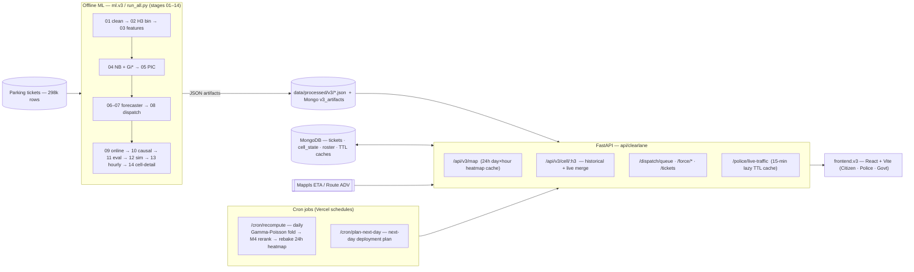
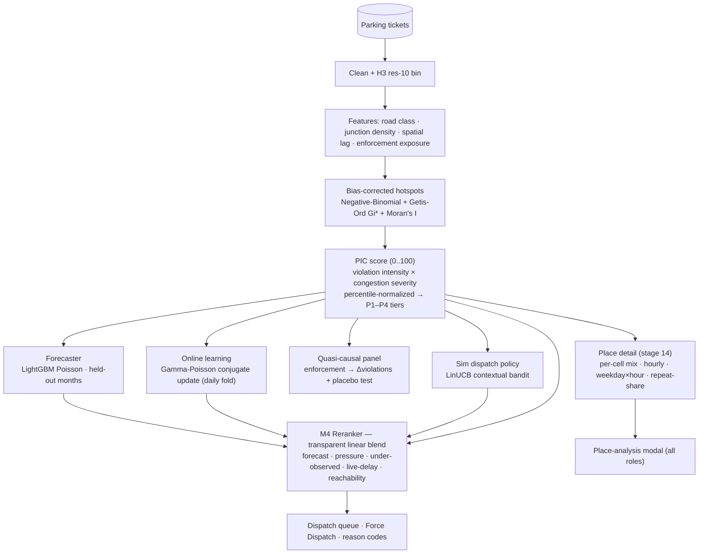

# ClearLane

**Parking enforcement that clears the lane.** ClearLane turns Bengaluru's raw parking-violation tickets into a **bias-corrected, hour-aware, multi-model deployment plan** — for citizens, police stations, and government.

> **Honesty contract:** we never claim to *measure* congestion from tickets (it's *modeled, not measured*), and we never rank individual officers. Everything is H3 cell- / station-level.

The data is **5 months of parking-violation tickets** (298k rows, Nov 2023 → Apr 2024) — no flow/speed/delay signal. A naive hotspot map just reproduces where police already patrol, so ClearLane **proves that bias, corrects for it**, and extracts operational intelligence on **H3 res-10 cells (~65 m)**.

- **Citizen** — parking hotspots near you + one-tap report of a lane-blocking vehicle.
- **Police** — **Force Dispatch**: where to deploy now, live patrol board, auto-allocation, ticket queue.
- **Government** — city-wide analytics, per-station view, model evidence scorecard.

Pitch deck: [`PRESENTATION.md`](./PRESENTATION.md) · Plain-language explainer: [`SIMPLE.md`](./SIMPLE.md) · Deploy: [`DEPLOY.md`](./DEPLOY.md).

---

## Architecture

### System design (cron + caching)

Offline ML bakes JSON artifacts → FastAPI serves them and merges **live operational** state (tickets, dispatch, Mappls ETA) → React renders. Cron jobs keep it fresh; lazy caches keep it cheap.



**Caching & freshness**
- **24-hour heatmap cache** — the day×hour PIC composite is baked per recompute, so map scrubbing is instant.
- **Live traffic — 15-minute lazy TTL** — Mappls ETA per station is fetched on demand and cached in MongoDB for 15 min (never blindly polled).
- **Recompute cron (daily)** — folds new verified outcomes into the Gamma-Poisson posterior, re-runs the M4 reranker, and re-bakes the heatmap.
- **Offline-first** — every frontend read falls back to a bundled demo bundle (`frontend.v3/public/demo-v3/`), so the app always renders.

### ML architecture (techniques)

Eight models, one transparent number.



| Technique | Where | What it gives |
|-----------|-------|---------------|
| Negative-Binomial exposure model + Getis-Ord Gi* / Moran's I | `ml.v3/04_exposure_nb.py` | hotspots corrected for patrol exposure (finds under-watched cells) |
| PIC = intensity × congestion severity (percentile-normalized) | `ml.v3/05_pic.py` | immutable 0..100 pressure + P1–P4 tiers |
| LightGBM Poisson forecaster (held-out months) | `ml.v3/06_forecast_daily.py` | next-month propensity (beats baseline deviance) |
| Gamma-Poisson conjugate online update | `ml.v3/09_online.py` | emerging cells, daily learning lift |
| Quasi-causal enforcement panel + placebo | `ml.v3/10_causal.py` | does enforcement actually reduce violations |
| LinUCB contextual bandit (vs greedy/random/oracle) | `ml.v3/12_sim_rl.py` | dispatch-policy uplift |
| M4 linear reranker + reason codes | `api/clearlane/v3.py` (`_rerank_rows`) | one 0..100 dispatch score, per station & city |
| Per-cell aggregation of 248k tickets | `ml.v3/14_cell_detail.py` | place-analysis modal data |

---

## Repo layout

```
api/clearlane/      FastAPI backend (v3 API, force/roster, operational layer, Mappls)
ml.v3/              offline ML pipeline (stages 01–14, run_all.py)
frontend.v3/        React + Vite app (Citizen · Police · Govt)
data/processed/v3/  baked JSON + parquet artifacts the API serves
```

---

## Run it locally

### 1. Backend (FastAPI)

```bash
# from the repo root
python -m venv .venv
. .venv/Scripts/activate            # macOS/Linux: source .venv/bin/activate
pip install -r requirements.txt

cp .env.example .env                 # fill in values (see table below)
uvicorn clearlane.main:app --reload --port 8000 --app-dir api
```

- **MongoDB is optional for local dev.** Without `MONGODB_URI` the API runs in *filesystem mode* (reads `data/processed/v3/*.json`); the map, place modal, dispatch and analytics all work. **Live tickets, dispatch state, and roster need MongoDB** — set `MONGODB_URI` to enable the operational layer.
- Artifacts in `data/processed/v3/` are already built. To regenerate: `python ml.v3/run_all.py`.

### 2. Frontend (React + Vite)

```bash
cd frontend.v3
npm install
npm run dev                          # http://localhost:5173
```

Vite proxies `/api` → `http://localhost:8000` (override with `VITE_BACKEND_PROXY`). The frontend is **offline-first**: if the backend is down it serves the bundled demo bundle, so it always renders.

Sign-in (demo): **Citizen** is open; **Police** logs in per station (`<station-slug>` / `<station-slug>`). The Government role exists but is hidden from the login for now.

### Environment (`.env` from `.env.example`)

| Var | Required | Purpose |
|-----|----------|---------|
| `MONGODB_URI` | prod / live ops | operational layer (tickets, cell state, roster, TTL caches) |
| `MONGODB_DB` | optional | DB name (default `clearlane`) |
| `MAPPLS_REST_KEY` | optional | live-traffic ETA / routing (else simulated fallback) |
| `USE_MAPPLE` | optional | `false` → CARTO/Leaflet basemap only (no Mappls SDK) |

Frontend (`frontend.v3/.env`, optional): `VITE_API_BASE` (absolute backend URL; empty = same-origin proxy) · `VITE_BACKEND_PROXY` (dev proxy target, default `http://localhost:8000`).

---

## Deploy

Vercel: serverless FastAPI (`api/`) + static frontend (`frontend.v3/`) + MongoDB Atlas, with Vercel Cron driving `/cron/recompute` (daily) and `/cron/plan-next-day`. See [`DEPLOY.md`](./DEPLOY.md).
