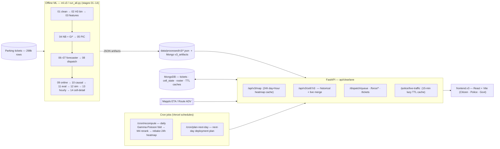
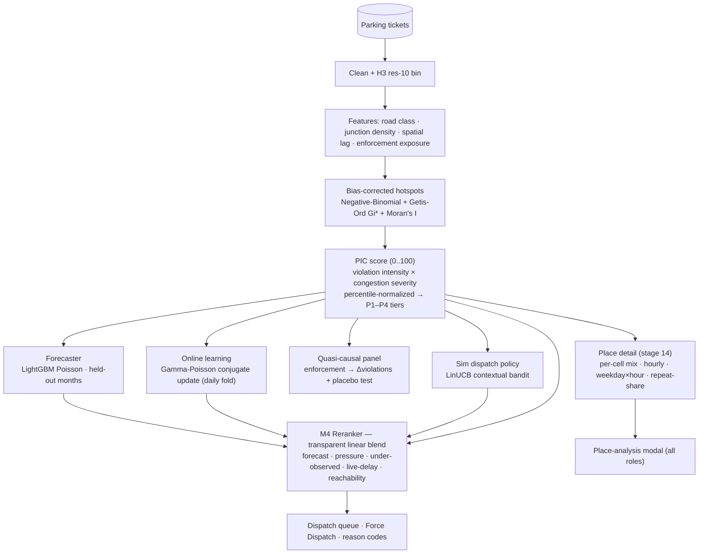

# TraFix

**Parking enforcement that clears the lane.** TraFix (**Tra**ffic + **Fix**) turns Bengaluru's raw parking-violation tickets into a **bias-corrected, hour-aware, multi-model deployment plan** — for citizens, police stations, and government.

> **Honesty contract:** we never claim to *measure* congestion from tickets (it's *modeled, not measured*), and we never rank individual officers. Everything is H3 cell- / station-level.

> **Name note:** **TraFix** is the product. `clearlane` is only the internal **engine codename** — it lives on in code paths (`api/clearlane/`, `uvicorn clearlane.main:app`) and the Mongo DB name. Same project, different label; nothing to deploy or rename.

The data is **5 months of parking-violation tickets** (298k rows, Nov 2023 → Apr 2024) — no flow/speed/delay signal. A naive hotspot map just reproduces where police already patrol, so TraFix **proves that bias, corrects for it**, and extracts operational intelligence on **H3 res-10 cells (~65 m)**.

- **Citizen** — parking hotspots near you + one-tap report of a lane-blocking vehicle.
- **Police** — **Force Dispatch**: where to deploy now, live patrol board, auto-allocation, ticket queue.
- **Government** — city-wide analytics, per-station view, model evidence scorecard.

Pitch deck: [`PRESENTATION.md`](./PRESENTATION.md) · Plain-language explainer: [`SIMPLE.md`](./SIMPLE.md) · Deploy: [`DEPLOY.md`](./DEPLOY.md).

---

## Architecture

### System design (cron + caching)

Offline ML bakes JSON artifacts → FastAPI serves them and merges **live operational** state (tickets, dispatch, Mappls ETA) → React renders. Cron jobs keep it fresh; lazy caches keep it cheap.



**Caching & freshness**
- **24-hour heatmap cache** — the day×hour PIC composite is baked per recompute, so map scrubbing is instant.
- **Live traffic — 15-minute lazy TTL** — Mappls ETA per station is fetched on demand and cached in MongoDB for 15 min (never blindly polled).
- **Recompute cron (daily)** — folds new verified outcomes into the Gamma-Poisson posterior, re-runs the M4 reranker, and re-bakes the heatmap.
- **Offline-first** — every frontend read falls back to a bundled demo bundle (`frontend.v3/public/demo-v3/`), so the app always renders.

### ML architecture (techniques)

Eight models, one transparent number.



| Technique | Where | What it gives |
|-----------|-------|---------------|
| Negative-Binomial exposure model + Getis-Ord Gi* / Moran's I | `ml.v3/04_exposure_nb.py` | hotspots corrected for patrol exposure (finds under-watched cells) |
| PIC = intensity × congestion severity (percentile-normalized) | `ml.v3/05_pic.py` | immutable 0..100 pressure + P1–P4 tiers |
| LightGBM Poisson forecaster (held-out months) | `ml.v3/06_forecast_daily.py` | next-month propensity (beats baseline deviance) |
| Gamma-Poisson conjugate online update | `ml.v3/09_online.py` | emerging cells, daily learning lift |
| Quasi-causal enforcement panel + placebo | `ml.v3/10_causal.py` | does enforcement actually reduce violations |
| LinUCB contextual bandit (vs greedy/random/oracle) | `ml.v3/12_sim_rl.py` | dispatch-policy uplift |
| M4 linear reranker + reason codes | `api/clearlane/v3.py` (`_rerank_rows`) | one 0..100 dispatch score, per station & city |
| Per-cell aggregation of 248k tickets | `ml.v3/14_cell_detail.py` | place-analysis modal data |

---

## Mathematical methods, algorithms & ML techniques

Every model below is **honest by construction** — it predicts violation **propensity / rate**, never measured congestion, and never an individual officer. Libraries: `statsmodels` (GLM), `scikit-learn` (PoissonRegressor, GroupKFold), `esda`/`libpysal` (Getis-Ord, Moran), `lightgbm`, `PuLP`/CBC, `scipy.stats`, `numpy`/`pandas`, `h3`.

### 1 · Bias-corrected hotspots — exposure-offset count GLM  (`ml.v3/04_exposure_nb.py`)

The core trick: tickets are *enforcement-shaped*, so we model the **rate per unit of enforcement effort**, not the raw count. A count GLM with an **exposure offset** (coefficient fixed to 1) turns a count model into a rate model:

```
citations_h ~ NegativeBinomial(μ_h)
log(μ_h) = β₀ + βᵀ·X_h + log(exposure_h)      # offset (fixed coef = 1)
exposure_h = distinct officers × active days (≥ EXPOSURE_MIN = 1)
```

- **Bias-corrected intensity** = predict at `offset = 0` (exposure = 1) ⇒ expected violations *per unit effort*. We rank on this, not on counts.
- **Over-dispersion handling.** Fit Poisson first, measure Pearson dispersion `Σ(y−μ)²/μ / df`. If `> 1.2`, estimate the NB2 dispersion **α** by the **Cameron–Trivedi** auxiliary OLS-through-origin: `z = ((y−μ)² − y)/μ`, `α = Σ(z·μ)/Σ(μ²)`, then refit `NB(α)`.
- **Effect sizes** as Incidence-Rate Ratios `IRR = exp(β)` (e.g. junction β=0.41 ⇒ ~1.51× the violation rate, holding exposure constant).
- **Spatial significance.** **Getis-Ord Gi\*** (`star=True`, 999 conditional permutations) gives each cell a z-score + pseudo-p; `sig_hot = (z > 0) & (p < 0.05)`. **Moran's I** on the **residuals** (should be ≈ 0) is a spatial-leakage / mis-specification check.
- **Validation without leakage.** Spatial-block CV: group cells into coarse **H3 res-7 blocks (~1.2 km)** and `GroupKFold` (k=5) over blocks so a cell and its neighbours never split across train/test. Report held-out **Poisson deviance**, **Spearman**(pred rate, observed rate), and **precision@K** (K ∈ {20, 50, 100}).
- **Under-policed signal.** `rank_divergence = rank_naive(count) − rank_bias(rate)`; a large positive value = a cell far more important than its ticket count suggests (a hidden hotspot; flagged when `> 100`).
- `intensity = percentile_norm(rate)` → uniform 0..100.

### 2 · PIC — Parking-Induced Congestion  (`ml.v3/05_pic.py`)

```
PIC_raw_h   = (intensity_h / 100) × CongestionSeverity_h
pic_score_h = percentile_norm(PIC_raw)         # 0..100  →  P1–P4 tiers
```

`CongestionSeverity ∈ [0,1]` is, per cell:
- **Modeled proxy** (default): `0.5·road_class + 0.3·junction_share + 0.2·neighbor_pressure` (clipped). Static road context — *never* derived from ticket data.
- **Mappls typical** (top-N intensity cells, when the key is set): `1 − distance_matrix / distance_matrix_eta` on a 400 m A→B corridor — Mappls' historical *typical* traffic, not real-time, clearly labelled.

### 3 · Day-ahead forecaster — LightGBM Poisson  (`ml.v3/06_forecast_daily.py`)

Panel = one row per (active cell × date). `objective = poisson`.
- **Features:** calendar (dow, is_weekend, month, day-of-month, holiday) · history (`lag1`, `lag7`, `roll7` — shifted, **no future leakage**) · context (intensity, road_class_wt, junction_share, repeat_share, vehicle footprint).
- **Temporal split:** last **21 days** held out (train strictly before).
- **Metrics:** held-out **Poisson deviance**, **MAE**, **Spearman**, and it must **beat a per-cell-mean baseline** (proof it learned day-of-week structure, not just the average). Output = a 7-value day-of-week expected curve + peak day per cell.

### 4 · Online learning — Gamma-Poisson conjugate  (`ml.v3/09_online.py`)

Each cell keeps a Bayesian "betting line" on its daily rate λ; Gamma is conjugate to Poisson, so an update is just **adding two numbers** (no refit):

```
prior      λ_h ~ Gamma(s₀, r₀)          # s₀ = r₀ = 1 (weak)
posterior  λ_h ~ Gamma(s₀ + Σy, r₀ + n)
E[λ_h]  = (s₀ + Σy)/(r₀ + n)            Var = (s₀ + Σy)/(r₀ + n)²
90% CI  = Gamma.ppf([.05,.95], a=shape, scale=1/rate)
```

**Emerging-hotspot drift** (scale-free, uses the model's own uncertainty — a closed-form cousin of Page-Hinkley / ADWIN): learn a baseline posterior from all-but-last 21 days, then
```
drift_z = (recent_rate − E_b[λ]) / sqrt(E_b/recent_days + Var_b)
emerging ⟺ drift_z > k  AND  recent_rate > ratio · E_b[λ]
```

### 5 · Quasi-causal enforcement panel — two-way fixed effects  (`ml.v3/10_causal.py`)

Honest observational estimand on the data we *have* (enforcement responsiveness), not a fabricated parking→delay number:

```
Δlog(viol)_{z,t→t+1} = α_z + γ_t + β · exposure_std_{z,t} + ε_{z,t}
α_z = cell fixed effect, γ_t = month fixed effect
```

Within (cell-demeaned) estimator + month dummies; **cluster-robust SEs by cell**. **Placebo test:** shuffle exposure across cells within each month (permutations) → β must collapse to ≈ 0; the real β is "distinguishable" only if it sits **outside** the empirical-null band. β<0 ⇒ enforcement precedes a drop (deterrence *or* mean-reversion — stated, not over-claimed).

### 6 · Exact dispatch optimisation — MCLP + VRP  (`ml.v3/08_dispatch.py`)

- **Coverage (Tier 1):** **Maximal Covering Location Problem** (Church & ReVelle) — pick ≤ `DISPATCH_OFFICERS = 25` patrol cells from top-PIC candidates to **maximise covered PIC**, where a cell covers demand within `0.8 km` (offline isochrone proxy). Solved **exactly with PuLP/CBC**; greedy-submodular fallback if no solver.
- **Routing (Tier 2):** VRP/TSP nearest-neighbour ordering from each station centroid.
- **Value check:** covered PIC vs the mean of random officer placements ⇒ the optimiser's uplift.

### 7 · Simulated dispatch policy — LinUCB contextual bandit  (`ml.v3/12_sim_rl.py`)

No real dispatch-outcome logs exist (timestamps 100% empty), so the sequential policy is trained/graded in a **data-calibrated simulator** (one shift = one day):

```
arrivals   v_h ~ Poisson(λ_h),  λ_h = Phase-5 online E[λ_h]   (arm universe = top 250 PIC cells)
reward     = Σ_{chosen h with v_h≥1} PIC_h  −  travel_penalty(chosen)   (send 25 officers)
```

- **LinUCB (disjoint)** context = `[1, intensity, congestion_severity, online_rate]`; UCB explores under-observed cells and reallocates away from high-PIC/low-arrival cells.
- Compared on identical realised arrivals against **random** (floor), **greedy top-PIC** (static), and **oracle** (per-shift hindsight, upper bound) ⇒ **regret** and uplift.

### 8 · M4 dispatch reranker — the served prediction blend  (`api/clearlane/v3.py · _rerank_rows`)

What actually ranks "where to send a unit now." A transparent **linear blend** of five components, each normalised to 0..1, weights summing to 1:

```
dispatch_score = 100 · Σ_k  w_k · component_k

w = { forecast 0.30, pressure 0.25, under_observed 0.15, live_delay 0.20, reachability 0.10 }

forecast       = weekly_expected / max_weekly                 (LightGBM curve)
pressure       = pic_score / 100                              (PIC, MODELED)
under_observed = min(rank_divergence / 200, 1)  else drift_z / 3
live_delay     = live severity (1 − free_flow/ETA)  else simulated day×hour proxy
reachability   = closeness to the station centroid (distance-decayed)
```

Tiers: `P1 ≥ 82, P2 ≥ 68, P3 ≥ 55, else P4`. Each row emits human **reason codes** (e.g. *high modeled pressure*, *forecast rising*, *blind-spot candidate*, *evening gap*, *+42% live delay*, *~2 min from station*). Recomputed per station and city-wide; baked hourly, recomputed inline on demand.

### 9 · Operational live layer — transparent three-number separation  (`api/clearlane/v3.py`)

The live loop **never edits the ML score**. Each cell shows three numbers:

```
operational_priority = clamp( historical_priority + live_adjustment , 0..100 )
```

`live_adjustment` is a bounded (≤ 40), **time-decaying** boost (`decay_per_hour = 1.0`) driven by citizen reports / officer outcomes (verified +12, towing +15, cleared → reset, false-alarm −10, …), and feeds a dispatch **bandit reward**. The hour-aware map multiplies the immutable `pic_score` by a **modeled day×hour congestion curve** (`display_score = pic_score × (0.4 + 0.6·congestion)`), so the map re-patterns across the day while ranking stays stable.

---

## Repo layout

```
api/clearlane/      FastAPI backend (v3 API, force/roster, operational layer, Mappls)
ml.v3/              offline ML pipeline (stages 01–14, run_all.py)
frontend.v3/        React + Vite app (Citizen · Police · Govt)
data/processed/v3/  baked JSON + parquet artifacts the API serves
```

---

## Run it locally

### 1. Backend (FastAPI)

```bash
# from the repo root
python -m venv .venv
. .venv/Scripts/activate            # macOS/Linux: source .venv/bin/activate
pip install -r requirements.txt

cp .env.example .env                 # fill in values (see table below)
uvicorn clearlane.main:app --reload --port 8000 --app-dir api
```

- **MongoDB is optional for local dev.** Without `MONGODB_URI` the API runs in *filesystem mode* (reads `data/processed/v3/*.json`); the map, place modal, dispatch and analytics all work. **Live tickets, dispatch state, and roster need MongoDB** — set `MONGODB_URI` to enable the operational layer.
- Artifacts in `data/processed/v3/` are already built. To regenerate: `python ml.v3/run_all.py`.

### 2. Frontend (React + Vite)

```bash
cd frontend.v3
npm install
npm run dev                          # http://localhost:5173
```

Vite proxies `/api` → `http://localhost:8000` (override with `VITE_BACKEND_PROXY`). The frontend is **offline-first**: if the backend is down it serves the bundled demo bundle, so it always renders.

Sign-in (demo): **Citizen** is open; **Police** logs in per station (`<station-slug>` / `<station-slug>`). The Government role exists but is hidden from the login for now.

### Environment (`.env` from `.env.example`)

| Var | Required | Purpose |
|-----|----------|---------|
| `MONGODB_URI` | prod / live ops | operational layer (tickets, cell state, roster, TTL caches) |
| `MONGODB_DB` | optional | DB name (default `clearlane`) |
| `MAPPLS_REST_KEY` | optional | live-traffic ETA / routing (else simulated fallback) |
| `USE_MAPPLE` | optional | `false` → CARTO/Leaflet basemap only (no Mappls SDK) |

Frontend (`frontend.v3/.env`, optional): `VITE_API_BASE` (absolute backend URL; empty = same-origin proxy) · `VITE_BACKEND_PROXY` (dev proxy target, default `http://localhost:8000`).

---

## Deploy

Vercel: serverless FastAPI (`api/`) + static frontend (`frontend.v3/`) + MongoDB Atlas, with Vercel Cron driving `/cron/recompute` (daily) and `/cron/plan-next-day`. See [`DEPLOY.md`](./DEPLOY.md).
